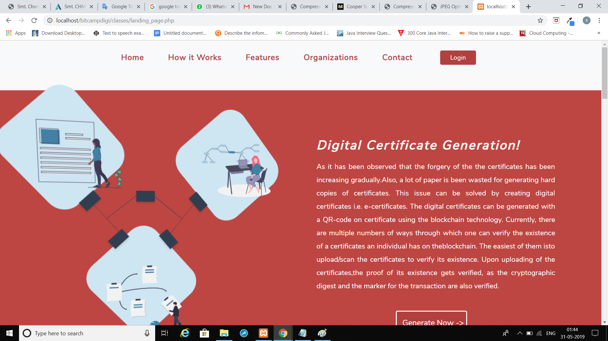
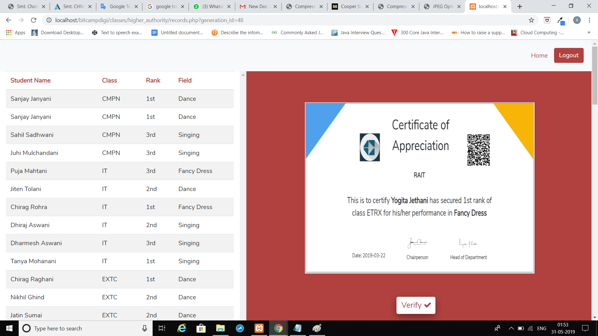
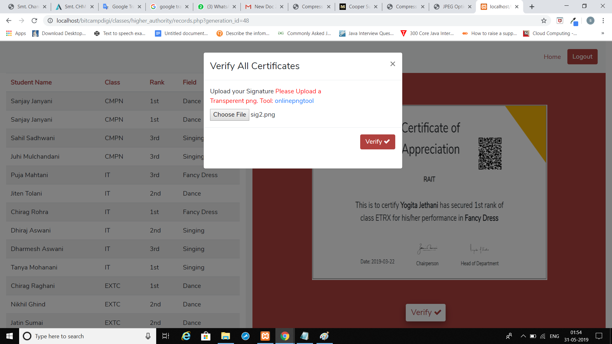

<b>DIGITAL CERTIFICATE GENERATION</b>

<b>Project Description</b>

As it has been observed that the forgery of the certificates has been increasing gradually. Also, alot of paper is been wasted for generating hard copies of certificates. This issue can be solved by generating digital certificates ie e-certificates.
The Digital Certificate can be generated using a QR code and making it more secure using the blockchain technology. Currently there are multiple no of ways through which one can verify the existence of a certificate that an individual owns on the blockchain.
The easiest way to verify its existence is to upload/scan the cerificate, by uploading the certificates the proof of its existence gets verified as the cryptographic digest and the markerfor the transaction are also verified.

<b>SCREENSHOTS OF THE USER INTERFACE</b>

<b>1. Landing page</b>

<b>2. Certificate templates to choose from</b>

<b>3. View the Certificate of a particular user for verification</b>

<b>4. View the verification status</b>

